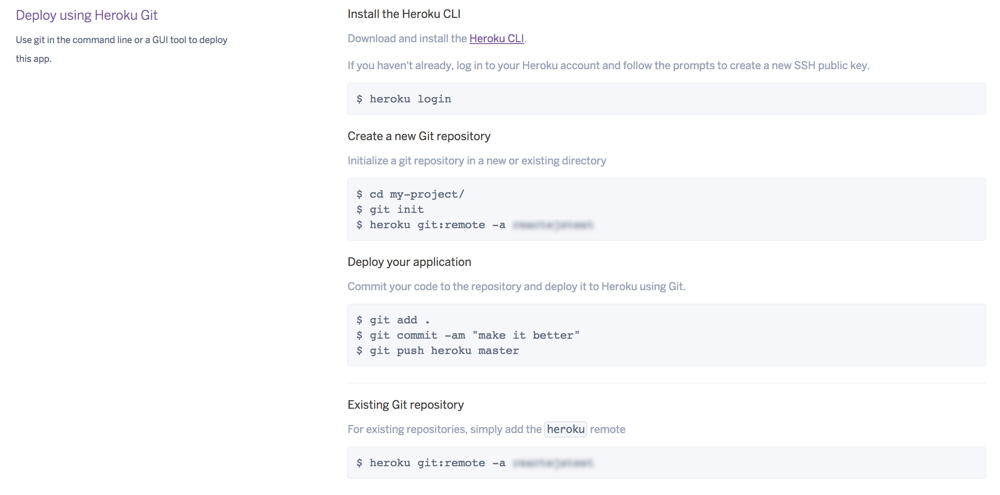

Author  : Ravi Teja Kesanam
E-mail  : kesanam.ravi@gmail.com

A Basic app with Heroku configuration setup. You can clone this and upload to you heroku server. File structure is understandable by observing packages.json & webpack.config.js

# Step 1 : npm run dev 
    for converting webpack to bundle.js -- ReactJS
    
# Step 2 : npm start
    to start the server & run port in http://localhost:3000
    
# Step 3 : Upload to Heroku & Test

